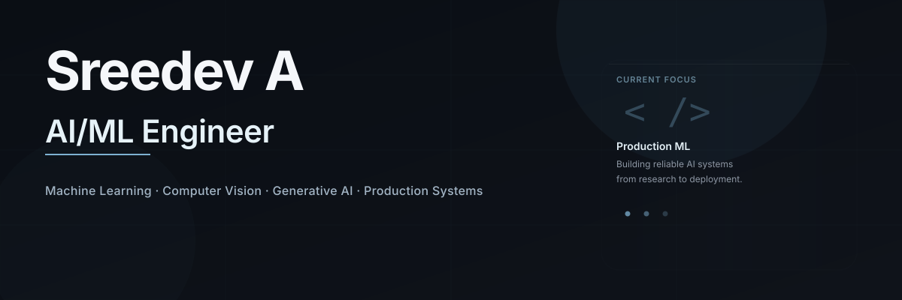

# Sreedev A

> AI/ML Engineer · Production Systems · Computer Vision · Generative AI

---

## About

I build **intelligent systems** that combine machine learning, computer vision, and software engineering. I focus on **production-ready solutions**—from adaptive AI platforms to real-time inference pipelines and full-stack products.

**Current:** AI/ML Engineer at **Meetmux** (Jan 2026 – Present)  
**Location:** Open to remote and on-site opportunities

---

## Selected Work

### AI-Proctored Assessment Platform
**Flagship Project** · AI • Computer Vision • Full Stack

Intelligent assessment platform with adaptive questions, webcam proctoring, deviation detection, and real-time analytics. Built with TensorFlow, FastAPI, and Next.js.

- Adaptive questioning engine
- ML-powered proctoring (face detection, gaze tracking)
- Real-time deviation alerts
- Production deployment with Docker & Kubernetes

**Links:** [GitHub](https://github.com) · [Live Demo](https://demo.link)

---

### Computer Vision & ML Specializations

**Cardiovascular Disease Detection from Retinal Images**  
Deep Learning • Computer Vision

CNN-based system for classifying cardiovascular disease indicators from fundus images. Achieved 91% accuracy with ResNet50 backbone.

---

**Real-Time Hand Gesture Recognition**  
Computer Vision • MediaPipe • TensorFlow

Real-time webcam gesture recognition using hand landmarks and machine learning. Deployed as web application with sub-100ms latency.

---

**Attendance Register ERP**  
Android • Firebase • Full Stack

Android attendance management system with role-based access control, real-time Firestore synchronization, and biometric integration.

---

## Toolkit

**Languages:** Python · Java · SQL · C  
**AI / ML:** TensorFlow · Keras · scikit-learn · CNN · NLP · SVM · XGBoost · K-Means  
**Computer Vision:** OpenCV · MediaPipe  
**Data:** NumPy · Pandas · Matplotlib · SciPy  
**Backend / Web:** FastAPI · Next.js · React · TypeScript · Tailwind CSS  
**DevOps:** Docker · Git · GitHub · Jupyter

---

## Quick Links

**Portfolio:** [sreedev-a.github.io](https://sreedev-a.github.io)  
**GitHub:** [github.com/Sreedev-a](https://github.com/Sreedev-a)  
**LinkedIn:** [linkedin.com/in/sreedev514162](https://www.linkedin.com/in/sreedev514162)  
**Email:** [sreedev514162@gmail.com](mailto:sreedev514162@gmail.com)

---

Building reliable AI systems · One model at a time

