# Sreedev A

> **AI/ML Engineer** · Building intelligent systems at scale
>
> Machine Learning · Computer Vision · Generative AI · Agentic AI · Full-Stack AI Applications

---

## Get in Touch

<table>
  <tr>
    <td align="center" width="25%">
      <strong>Portfolio</strong> 
      <a href="https://sreedev-a.github.io">sreedev-a.github.io</a>
    </td>
    <td align="center" width="25%">
      <strong>LinkedIn</strong> 
      <a href="https://www.linkedin.com/in/sreedev514162/">sreedev514162</a>
    </td>
    <td align="center" width="25%">
      <strong>GitHub</strong> 
      <a href="https://github.com/Sreedev-a">@Sreedev-a</a>
    </td>
    <td align="center" width="25%">
      <strong>Email</strong> 
      <a href="mailto:sreedev514162@gmail.com">sreedev514162@gmail.com</a>
    </td>
  </tr>
</table>

---

## Engineering Snapshot

---

## What I Build

**Intelligent Applications**  
End-to-end AI/ML systems built around real workflows rather than isolated research models.

**Real-Time Computer Vision**  
Detection, monitoring, recognition and visual automation systems with sub-100ms latency.

**Agentic Systems**  
LLM agents that retrieve knowledge, call tools, plan multi-step workflows and generate evidence.

**Production AI APIs**  
FastAPI services, data pipelines, model integration, evaluation and robust application backends.

---

## Currently Building

| Project | Role | Status |
| --- | --- | --- |
| **AI Operations Copilot** | Creator | Active · [GitHub](https://github.com/Sreedev-a/AI-Operations-Copilot) |
| **AI-Proctored Assessment Platform** | Creator | Stable · [GitHub](https://github.com/Sreedev-a/AI-Proctored-Assessment-Platform) |
| **ML/AI Research** | Continuous | Exploring · [Portfolio](https://sreedev-a.github.io) |

---

## Featured Engineering

### AI Operations Copilot

**Agentic AI platform for incident investigation, root-cause analysis and remediation.**

An observatory incident command center where AI agents investigate failures, execute safe tools, gather evidence, rank hypotheses, and recommend mitigations—all under human approval.

- **Agent Orchestration:** Multi-step reasoning with tool selection, evidence gathering and hypothesis ranking
- **Safe Tool Execution:** Read-only diagnostics (logs, health, deployments, RAG, incidents, databases)
- **Human-in-the-Loop:** Every remediation gated behind recorded human approval
- **Evaluation Framework:** RCA accuracy, tool selection precision, evidence coverage metrics
- **Reproducible Demo:** Works without paid APIs using deterministic reasoning and local retrieval

**Tech Stack**  
`Python` · `FastAPI` · `Next.js` · `TypeScript` · `SQLite` · `Local RAG` · `Agent Workflows` · `Docker`

**GitHub:** [Sreedev-a/AI-Operations-Copilot](https://github.com/Sreedev-a/AI-Operations-Copilot)

---

### AI-Proctored Assessment Platform

**Full-stack intelligent assessment combining adaptive testing, real-time computer-vision proctoring and evidence capture.**

A complete online examination platform with adaptive questioning, live webcam monitoring, deviation detection, and administrative review dashboards for assessment integrity.

- **Adaptive Assessment Engine:** Performance-driven question selection across six technical tracks
- **AI Computer Vision:** YOLO object detection (people, phones, books, screens) + MediaPipe gaze analysis
- **Browser Integrity:** Fullscreen, tab focus, keyboard and event monitoring with structured audit trails
- **Evidence Management:** Captured images for confirmed violations with risk scoring
- **Complete Workflow:** Candidate registration, assessment delivery, proctoring and admin review

**Tech Stack**  
`Python` · `FastAPI` · `Next.js` · `TypeScript` · `OpenCV` · `YOLO` · `MediaPipe` · `SQLite` · `Docker`

**GitHub:** [Sreedev-a/AI-Proctored-Assessment-Platform](https://github.com/Sreedev-a/AI-Proctored-Assessment-Platform)

---

## AI Lab: Explorations & Experiments

Small prototypes, research and engineering explorations across AI/ML.

### Computer Vision
Experiments in detection, tracking, real-time inference and visual understanding.

### RAG & Retrieval
Exploration of chunking strategies, embeddings, retrieval evaluation and contextual generation.

### Agent Tool Calling
Building and testing AI agents that interact reliably with controlled external tools.

### Model Evaluation
Metrics, benchmarking, evaluation datasets and model quality assessment.

### API Prototyping
FastAPI services for ML workflows, inference serving and data pipelines.

---

## Experience

### AI/ML Engineer — Meetmux
**Jan 2026 – Present**  
Building AI-powered features and production ML systems.

### Machine Learning Intern — Feyn Labs
**Oct 2024 – Mar 2025**  
Generative AI research and model development.

### AI & ML Intern — Aerobosoft
**Aug 2023 – Oct 2023**  
Machine learning systems and computer vision applications.

---

## Engineering Interests

Exploring and building across these areas:

`Generative AI` · `Agentic AI` · `RAG & Retrieval` · `Computer Vision` · `Multimodal AI` · `MLOps` · `AI Evaluation` · `Intelligent Automation` · `Backend Engineering` · `Production ML`

---

## Tech Ecosystem

### Core Languages
`Python` · `TypeScript` · `SQL`

### AI & ML Frameworks
`TensorFlow` · `Keras` · `scikit-learn` · `OpenCV` · `MediaPipe`

### AI Engineering
`RAG` · `Embeddings` · `Agent Workflows` · `Tool Calling` · `Prompt Engineering`

### Backend & APIs
`FastAPI` · `REST APIs` · `Async Python`

### Frontend
`Next.js` · `React 19` · `TypeScript` · `Tailwind CSS` · `Radix UI`

### Data & Visualization
`NumPy` · `Pandas` · `Matplotlib` · `SciPy`

### DevOps & Tools
`Docker` · `Docker Compose` · `GitHub Actions` · `Git` · `Make`

### Development
`VS Code` · `Jupyter` · `pytest` · `Pydantic` · `SQLAlchemy`

---

## Systems & Concepts

**Architecture & Design**  
REST API design · ML inference services · full-stack application architecture · microservices

**ML Pipelines**  
Data preprocessing · feature engineering · model training · inference serving · evaluation

**Computer Vision**  
Detection pipelines · real-time processing · evidence capture · multi-model orchestration

**Agent Systems**  
Tool selection · workflow orchestration · hypothesis management · human-in-the-loop approval

**Data Management**  
Structured logging · audit trails · evidence persistence · risk scoring

**Operations**  
Containerization · CI/CD workflows · local and cloud deployment · development efficiency

---

## Repository Spotlight

| Repository | Description | Tech | Links |
| --- | --- | --- | --- |
| **AI Operations Copilot** | Agentic incident investigation platform | Python, FastAPI, Next.js, RAG | [→](https://github.com/Sreedev-a/AI-Operations-Copilot) |
| **AI-Proctored Assessment Platform** | Adaptive testing + computer vision proctoring | Python, FastAPI, Next.js, OpenCV | [→](https://github.com/Sreedev-a/AI-Proctored-Assessment-Platform) |
| **Portfolio Website** | Professional project showcase | Next.js, React, TypeScript, Tailwind | [→](https://github.com/Sreedev-a/Sreedev-a.github.io) |
| **Meetmux** | Production ML workspace | Python, FastAPI | [→](https://github.com/Sreedev-a/meetmux) |

---

## Engineering Focus Areas

### Building AI Beyond the Notebook

Taking research models and experiments into production-ready APIs, complete applications and deployed systems.

### Reliable Agentic Systems

Tool control, observability, agent evaluation and human-in-the-loop approval for safety and accountability.

### Practical Computer Vision

Real-time inference pipelines, monitoring systems and evidence-based workflows rather than isolated demos.

### Evaluating AI Systems

Measuring system quality with structured metrics rather than relying only on anecdotal examples.

---

## Now

Actively building agentic AI systems, improving production-oriented ML engineering skills and exploring intelligent automation workflows that combine multiple tools and reasoning strategies.

---

## Education

**B.Tech — Artificial Intelligence & Machine Learning**  
`2024`

---

## Let's Build Something Intelligent

Interested in AI/ML engineering opportunities, technical collaborations and challenging problems.

**Explore the full portfolio** for project visuals, engineering experience and detailed work.

[View Portfolio →](https://sreedev-a.github.io) · [LinkedIn →](https://www.linkedin.com/in/sreedev514162/) · [Email →](mailto:sreedev514162@gmail.com)

---

  Building intelligent systems · One model at a time

