<div align="center">
  
</div>

<div align="center">
  
  <p>
    <a href="https://sreedev-a.github.io"></a>
    <a href="https://github.com/Sreedev-a"></a>
    <a href="https://www.linkedin.com/in/sreedev514162/"></a>
    <a href="https://sreedev-a.github.io/resume/Sreedev_A_Resume.pdf"></a>
  </p>
  <p><strong>Sree Dev A · AI/ML Engineer · Bengaluru, India</strong></p>
</div>

## About me

I'm Sree Dev A, an AI/ML Engineer focused on building practical, production-oriented intelligent systems using machine learning, deep learning, computer vision, generative AI and modern software engineering. I care about the complete path from an experiment to an application someone can use.

Engineering lifecycle: **DATA → MODEL → API → APPLICATION → DEPLOYMENT**

My interests span visual understanding, LLMs, retrieval-augmented generation, AI agents, model optimization and full-stack AI applications.

## Featured projects

### AI-Proctored-Assessment-Platform

> **Flagship · Full-stack AI + computer vision**
>
> An adaptive assessment platform that brings testing, webcam analysis, browser-integrity monitoring and evidence review into one candidate/admin workflow.

**Key features:** Performance-driven question selection; YOLO object/person detection; MediaPipe face and iris analysis; evidence capture, risk events and review dashboards.

**Stack:** Python · FastAPI · OpenCV · YOLO · MediaPipe · Next.js · TypeScript · SQLAlchemy

```text
Webcam + browser signals
           |
   Vision + integrity checks
           |
   Evidence + risk events
           |
     Admin review
```

<a href="https://github.com/Sreedev-a/AI-Proctored-Assessment-Platform"></a>
<a href="https://frontend-five-blond-42.vercel.app/login"></a>

### AI-Operations-Copilot

An incident-investigation prototype with deterministic agent orchestration, local knowledge retrieval and exportable postmortems. Its synthetic scenarios and simulated remediation make the workflow inspectable and reproducible.

**Key features:** Allowlisted diagnostic tools; ranked hypotheses; evidence and execution traces; scenario evaluation; human approval of simulated actions.

**Stack:** Python · FastAPI · Next.js · TypeScript · Docker · GitHub Actions

```text
Incident -> Diagnostic plan
                 |
        Tools + local retrieval
                 |
        Evidence + hypotheses
                 |
        Approval -> Simulation
```

<a href="https://github.com/Sreedev-a/AI-Operations-Copilot"></a>

### automatic-face-blur · Veil

A local computer-vision utility for detecting frontal faces and applying adjustable blur before sharing images.

**Key features:** OpenCV Haar-cascade detection; adjustable Gaussian blur; before/after preview; PNG export. Images stay in the local process; detection results can be reviewed before export.

**Stack:** Python · OpenCV · Streamlit · NumPy · Pillow

```text
Image -> Face regions -> Blur
                          |
                   Preview -> PNG
```

<a href="https://github.com/Sreedev-a/automatic-face-blur"></a>

### human-atlas · Human Atlas

An interactive 3D anatomy explorer built around the open BodyParts3D dataset. This frontend engineering project complements my AI work with interactive visualization and accessible product design.

**Key features:** Anatomical search; selectable structures and body systems; isolation and exploded views; touch navigation; light/dark themes.

**Stack:** React · TypeScript · Three.js · React Three Fiber · Vite · Tailwind CSS

<a href="https://github.com/Sreedev-a/human-atlas"></a>
<a href="https://human-atlas-kappa.vercel.app"></a>

<details>
<summary><strong>Computer vision explorations</strong></summary>

These projects are documented in my [portfolio](https://sreedev-a.github.io); public source repositories are not currently linked.

**Cardiovascular Disease Detection from Retinal Images** — A CNN-based exploration of cardiovascular indicators in retinal fundus images, covering preprocessing, model training and classification.

**Stack:** Python · TensorFlow · Keras · OpenCV

```text
Retinal image -> Preprocessing
                     |
                    CNN
                     |
                Classification
```

**Real-Time Hand Gesture Recognition** — Webcam-based gesture recognition using hand landmarks and visual inference.

**Stack:** Python · OpenCV · MediaPipe · TensorFlow

```text
Camera -> Landmarks -> Gesture class
```

</details>

<details>
<summary><strong>More engineering work &amp; experiments</strong></summary>

- [FriendCircle](https://github.com/Sreedev-a/FriendCircle) — Kotlin/Jetpack Compose learning build with reusable mobile UI, efficient lists and accessible avatars.
- [meetmux](https://github.com/Sreedev-a/meetmux) — ML environment setup and an MLflow smoke test.
- [Task3_Core_Architecture](https://github.com/Sreedev-a/Task3_Core_Architecture) — Configurable training, evaluation and experiment logging scaffolding.
- [Task4_Preprocessing](https://github.com/Sreedev-a/Task4_Preprocessing) — Preprocessor construction and serialization for later inference.
- [task2_feature_profiling](https://github.com/Sreedev-a/task2_feature_profiling) — Data and feature exploration.
- [Sreedev-a.github.io](https://github.com/Sreedev-a/Sreedev-a.github.io) — My Next.js, React and TypeScript portfolio.

</details>

## Technology stack

**AI / Machine Learning**<br />
<br />
Keras · NumPy · Pandas

**Computer Vision**<br />
<br />
MediaPipe · YOLO · CNNs

**Generative AI**<br />
Local retrieval and agent orchestration prototypes; exploring LLMs, RAG and tool calling.

**Backend**<br />
<br />
REST APIs · SQLAlchemy · Streamlit

**Frontend**<br />


**Databases**<br />
<br />
SQLite assessment persistence; PostgreSQL deployment configuration.

**DevOps / Deployment**<br />


## Current focus

- **LLMs, AI agents & RAG** — Retrieval quality, controlled tool calling and useful application workflows.
- **Advanced computer vision & model optimization** — Better preprocessing, inference and evaluation.
- **Production AI deployment** — Connecting models, APIs and interfaces with reproducible builds and observable behavior.

## Engineering philosophy

**Build → Measure → Improve → Deploy**<br />
AI becomes valuable when models move beyond notebooks and become usable systems.

<details>
<summary><strong>Experience &amp; education</strong></summary>

- **AI/ML Engineer — Meetmux** · Jun 2026–Present. AI-powered features and production-oriented ML systems.
- **Data Analysis Intern — Cognifyz Technologies** · Mar–May 2026. Data analysis and practical data-driven problem solving.
- **Cloud Engineering Intern — InternAge** · Feb–May 2026. Cloud engineering concepts and workflows.
- **Superintelligence & AI Intern — Chiac ASI** · Feb–May 2026. Emerging AI concepts and approaches.
- **Machine Learning Intern — Feyn Labs** · Oct 2024–Mar 2025. Generative AI research and model development.
- **AI & ML Intern — Aerobosoft** · Aug–Oct 2023. Machine learning and computer vision applications.

**B.Tech — Artificial Intelligence & Machine Learning** · 2024

</details>

## GitHub analytics

<p align="center">
  <picture>
    <source media="(prefers-color-scheme: dark)" srcset="https://github-profile-summary-cards.vercel.app/api/cards/stats?username=Sreedev-a&amp;theme=github_dark" />
    
  </picture>
  <picture>
    <source media="(prefers-color-scheme: dark)" srcset="https://github-profile-summary-cards.vercel.app/api/cards/repos-per-language?username=Sreedev-a&amp;theme=github_dark" />
    
  </picture>
</p>

<picture>
  <source media="(prefers-color-scheme: dark)" srcset="https://github-profile-summary-cards.vercel.app/api/cards/profile-details?username=Sreedev-a&amp;theme=github_dark" />
  
</picture>

## Contribution snake

<picture>
  <source media="(prefers-color-scheme: dark)" srcset="https://raw.githubusercontent.com/Sreedev-a/Sreedev-a/output/github-contribution-grid-snake-dark.svg" />
  <source media="(prefers-color-scheme: light)" srcset="https://raw.githubusercontent.com/Sreedev-a/Sreedev-a/output/github-contribution-grid-snake.svg" />
  
</picture>

<sub>Updated daily by <a href="https://github.com/Sreedev-a/Sreedev-a/actions/workflows/snake.yml">GitHub Actions</a>.</sub>

---

Open to AI/ML engineering opportunities, collaborations and challenging technical problems.

[Portfolio](https://sreedev-a.github.io) · [LinkedIn](https://www.linkedin.com/in/sreedev514162/) · [Email](mailto:sreedev514162@gmail.com)
