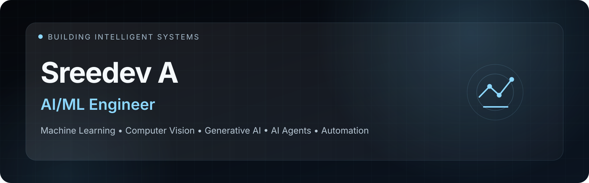
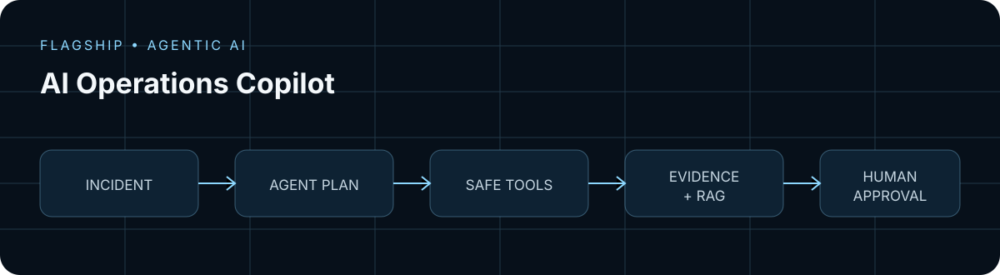
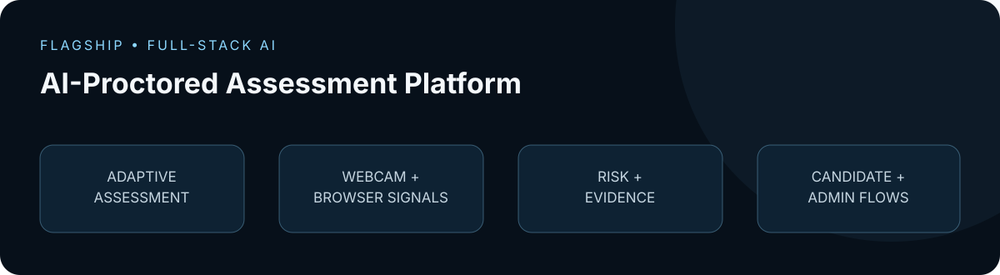
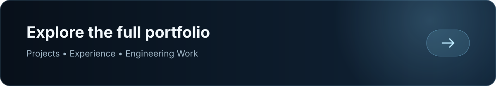

  

   

  
  
  
  

## About

I'm an **AI/ML Engineer** with a B.Tech in Artificial Intelligence & Machine Learning. I build intelligent software systems across machine learning, computer vision, generative AI, agents, and automation—with an emphasis on turning experiments into usable applications.

## Engineering Snapshot

## Experience

**AI/ML Engineer — Meetmux** · `Jan 2026 – Present` 
Building AI-powered features and production-minded ML systems.

**Machine Learning Intern — Feyn Labs** · `Oct 2024 – Mar 2025` 
Worked on generative AI research and model development.

**AI & ML Intern — Aerobosoft** · `Aug 2023 – Oct 2023` 
Worked on machine learning and computer vision applications.

## Featured Engineering

### [AI Operations Copilot](https://github.com/Sreedev-a/AI-Operations-Copilot)

Agentic AI platform for incident investigation, root-cause analysis, RAG-powered diagnostics, tool calling, evaluation, and human-approved remediation.

`Python` · `FastAPI` · `Next.js` · `RAG` · `AI Agents` · `Docker`

### [AI-Proctored Assessment Platform](https://github.com/Sreedev-a/AI-Proctored-Assessment-Platform)

Intelligent online assessment platform combining adaptive testing, AI-powered webcam proctoring, evidence capture, risk analysis, and candidate/admin workflows.

`Python` · `FastAPI` · `Next.js` · `TypeScript` · `OpenCV`

<table>
  <tr>
    <td width="50%"></td>
    <td width="50%"></td>
  </tr>
  <tr>
    <td valign="top"><strong>Cardiovascular Disease Detection from Retinal Images</strong>  Computer-vision exploration using retinal images and convolutional neural networks.  <code>Python · TensorFlow · Keras · OpenCV · CNN</code></td>
    <td valign="top"><strong>Real-Time Hand Gesture Recognition</strong>  Real-time gesture recognition exploration built around hand landmarks and visual inference.  <code>Python · OpenCV · MediaPipe · TensorFlow</code></td>
  </tr>
</table>

## Currently Building

- **AI Operations Copilot** — active portfolio project with deterministic incident scenarios, safe diagnostic tools, evaluation, and human approval.
- **AI-Proctored Assessment Platform** — full-stack adaptive assessment and computer-vision proctoring workflows.
- **Agentic AI workflows** — exploring retrieval, controlled tool calling, observability, and system evaluation.

## AI Lab

*Experiments, prototypes and engineering explorations.*

`Experiment · RAG retrieval` &nbsp; `Prototype · AI agents` &nbsp; `Exploring · Tool calling` 
`Experiment · Computer vision` &nbsp; `Exploring · ML evaluation` &nbsp; `Prototype · FastAPI APIs` 
`Exploring · Automation` &nbsp; `Experiment · Model optimization`

## Tech Ecosystem

**Languages** 
    

**AI / ML & Data** 
    

**Application Engineering** 
     

**AI Engineering** 
`RAG` · `Embeddings` · `Agents` · `Tool Calling` · `Evaluation`

## Systems & Concepts

`REST APIs` · `ML inference` · `computer vision pipelines` · `agent orchestration` · `RAG` · `tool calling` · `event logging` · `human-in-the-loop` · `evaluation pipelines` · `Docker` · `CI/CD` · `model preprocessing` · `risk scoring` · `evidence capture`

## Repository Spotlight

- **[AI Operations Copilot](https://github.com/Sreedev-a/AI-Operations-Copilot)** — agentic incident investigation, evidence, evaluation, and controlled remediation.
- **[AI-Proctored Assessment Platform](https://github.com/Sreedev-a/AI-Proctored-Assessment-Platform)** — adaptive testing with computer-vision proctoring and review workflows.
- **[Portfolio](https://github.com/Sreedev-a/Sreedev-a.github.io)** — Apple-inspired glass portfolio built with Next.js, React, and TypeScript.
- **[FriendCircle](https://github.com/Sreedev-a/FriendCircle)** — Kotlin and Jetpack Compose learning build focused on reusable mobile UI.

## Selected Experiments

- **[ML Environment Setup](https://github.com/Sreedev-a/meetmux)** — `Learning Build` · reproducible scikit-learn environment and MLflow smoke test.
- **[Core ML Architecture](https://github.com/Sreedev-a/Task3_Core_Architecture)** — `Prototype` · configurable training, evaluation, and experiment logging structure.
- **[Feature Profiling](https://github.com/Sreedev-a/task2_feature_profiling)** — `Experiment` · data and feature exploration workflow.

## GitHub Activity

  
  
   
  

## Engineering Notes

- **Building AI Beyond the Notebook** — turning model experiments into usable software systems.
- **Reliable Agentic Systems** — tool control, observability, evaluation, and human approval.
- **Practical Computer Vision** — real-time inference, monitoring, and evidence-driven workflows.
- **Evaluating AI Systems** — measuring system quality rather than relying only on demos.

## Now

Building agentic AI systems, improving production-oriented ML engineering skills, and experimenting with intelligent automation.

## Education

**B.Tech — Artificial Intelligence & Machine Learning** · `2024`

## Let's Build Something Intelligent.

Interested in AI/ML engineering opportunities, collaborations, and challenging technical problems.

[Portfolio](https://sreedev-a.github.io) · [LinkedIn](https://www.linkedin.com/in/sreedev514162/) · [Email](mailto:sreedev514162@gmail.com) · [GitHub](https://github.com/Sreedev-a)
