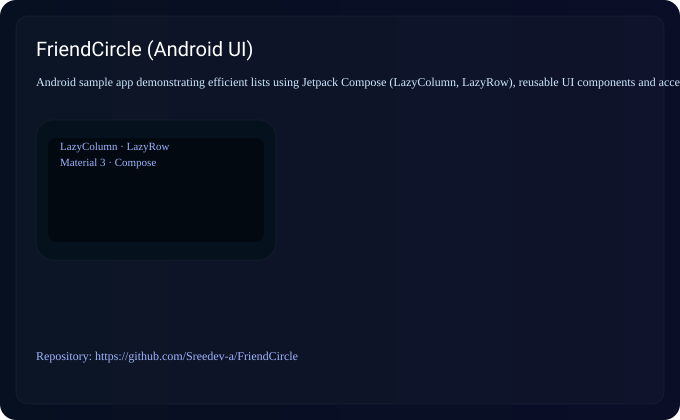
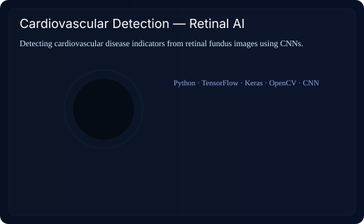
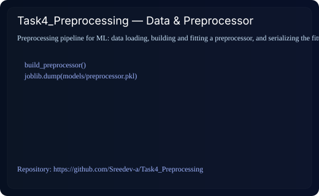
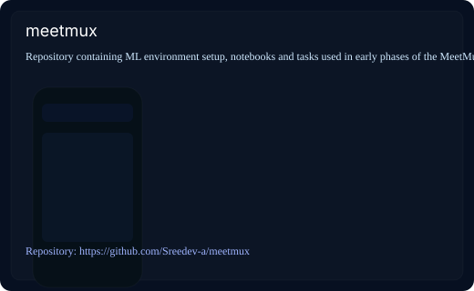
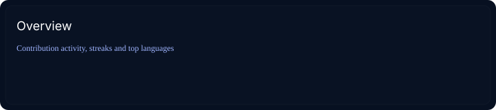
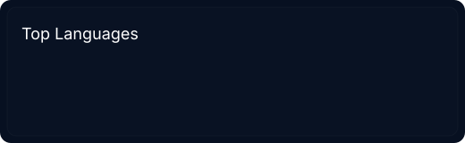

# Sreedev A — AI/ML Engineer

  <!-- Use local optimized cover images to mirror portfolio visuals -->
  <picture>
    <source srcset="./assets/ai-proctoring-cover.svg" type="image/svg+xml">
    
  </picture>

---

  
  &nbsp;&nbsp;
  
  &nbsp;&nbsp;
  
  &nbsp;&nbsp;
  

---

> AI/ML Engineer focused on building reliable, production-ready systems in machine learning, computer vision, and automation.

I design and ship practical AI products — from research-grade models to full-stack AI services and MLOps. My work prioritizes robust engineering, clear metrics and humane UX.

### Current Role

  

  
  
AI/ML Engineer — <strong>Meetmux</strong> · Jan 2026 — Present

---

## Selected Work

A visual selection of my recent projects. Click each card to open the repository. Animated demos (GIF) will play when present.

<!-- row 1 -->
<table style="width:100%; border-collapse:collapse;">
  <tr>
    <td style="width:50%; padding:8px; vertical-align:top;">
      <a href="https://github.com/Sreedev-a/FriendCircle" title="FriendCircle">
        <picture>
          <source srcset="./assets/ai-proctoring-cover.svg" type="image/svg+xml">
          
        </picture>
      </a>
      
<strong>FriendCircle — Android UI (highlight)</strong> Polished Jetpack Compose sample demonstrating performant lists (LazyColumn/LazyRow), reusable components and accessible avatars. Ideal for mobile UI prototyping and list performance patterns.

      
<strong>Tech:</strong> Kotlin · Jetpack Compose · Material 3

    </td>

    <td style="width:50%; padding:8px; vertical-align:top;">
      <a href="https://github.com/Sreedev-a/Task3_Core_Architecture" title="Task3 Core Architecture">
        <picture>
          <source srcset="./assets/retinal-diagnostics-cover.svg" type="image/svg+xml">
          
        </picture>
      </a>
      
<strong>Task3_Core_Architecture — ML Training</strong> Config-driven training pipelines, baseline models and evaluation utilities with reproducible experiment logging. Suitable as a template for model development and evaluation.

      
<strong>Tech:</strong> Python · scikit-learn · experiment logging

    </td>
  </tr>

  <tr><td colspan="2" style="height:12px"></td></tr>

  <tr>
    <td style="width:50%; padding:8px; vertical-align:top;">
      <a href="https://github.com/Sreedev-a/Task4_Preprocessing" title="Task4 Preprocessing">
        <picture>
          <source srcset="./assets/hand-gesture-cover.svg" type="image/svg+xml">
          
        </picture>
      </a>
      
<strong>Task4_Preprocessing — Data & Pipelines</strong> Preprocessing utilities and a preprocessor build flow. Includes train script that fits and serializes preprocessing for downstream inference.

      
<strong>Tech:</strong> Python · joblib · data pipelines

    </td>

    <td style="width:50%; padding:8px; vertical-align:top;">
      <a href="https://github.com/Sreedev-a/meetmux" title="MeetMux">
        <picture>
          <source srcset="./assets/attendance-erp-cover.svg" type="image/svg+xml">
          
        </picture>
      </a>
      
<strong>meetmux — ML environment & tasks</strong> Environment setup, notebooks and early ML tasks for the MeetMux product. Reproducible environment scripts and evaluation artifacts.

      
<strong>Tech:</strong> Python · Jupyter · MLflow

    </td>
  </tr>
</table>

---

## Toolbox

### AI / Machine Learning
Python · TensorFlow · Keras · scikit-learn · OpenCV · MediaPipe · Pandas · NumPy

### Backend
FastAPI · REST APIs · SQL

### Frontend
Next.js · React · TypeScript · Tailwind CSS

### DevOps / Tools
Git · GitHub · Docker · VS Code · Jupyter · Cloudflare

---

## Experience

- AI/ML Engineer — Meetmux · Jan 2026 — Present
- Machine Learning Intern — Feyn Labs · Oct 2024 — Mar 2025
- AI & ML Intern — Aerobosoft · Aug 2023 — Oct 2023

---

## GitHub Activity

  
   
  

---

## Let's Build Something Intelligent

I'm interested in AI/ML engineering, computer vision, intelligent automation and building practical AI-powered products. I welcome conversations about engineering roles and collaborations.

  <a href="https://sreedev-a.github.io" style="text-decoration:none; padding:12px 22px; border-radius:14px; background:linear-gradient(90deg,#061627,#093046); color:#00d9ff; font-weight:700; font-size:15px; display:inline-block;">Visit my Portfolio →</a>
  &nbsp;&nbsp;&nbsp;
  <a href="https://www.linkedin.com/in/sreedev514162/" style="text-decoration:none; color:#9fb4ff; font-weight:600;">LinkedIn →</a>

---

  

