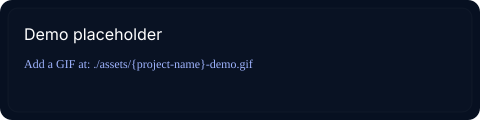

# Sreedev A — AI/ML Engineer

  

---

  
  &nbsp;&nbsp;
  
  &nbsp;&nbsp;
  
  &nbsp;&nbsp;
  

---

> AI/ML Engineer focused on building practical intelligent systems across machine learning, computer vision, automation and modern web technologies.

I design and deploy production-ready AI systems that solve real problems — from computer vision pipelines and model APIs to full-stack AI applications and MLOps.

### Current Role

  

  
  
AI/ML Engineer — <strong>Meetmux</strong> · Jan 2026 — Present

---

## Selected Work

  <table style="width:100%; border-collapse:collapse;">
    <tr>
      <td valign="top" style="padding:6px; width:50%;">
        
      </td>
      <td valign="top" style="padding:6px; width:50%;">
        
      </td>
    </tr>
    <tr><td colspan="2" style="height:12px"></td></tr>
    <tr>
      <td valign="top" style="padding:6px; width:50%;">
        
      </td>
      <td valign="top" style="padding:6px; width:50%;">
        
      </td>
    </tr>
  </table>

  <strong>Primary highlight — FriendCircle (Android)</strong>: an Android sample app implementing efficient scrollable lists using Jetpack Compose (LazyColumn/LazyRow), reusable components and accessible avatars. Repository demonstrates practical mobile UI patterns and Compose best practices.

  <strong>Task3_Core_Architecture</strong>: project scaffolding for core ML training pipelines — config-driven training, baseline models and evaluation scripts (Python, scikit-learn).

  <strong>Task4_Preprocessing</strong>: preprocessing and pipeline utilities. Includes a build_preprocessor() function and a train script that serializes the fitted preprocessor (models/preprocessor.pkl) for downstream inference.

  <strong>meetmux</strong>: repository contains ML environment setup, notebooks and early-phase tasks used in the MeetMux project.

  <!-- demo placeholders -->
  
  &nbsp;&nbsp;
  

---

## Toolbox

### AI / Machine Learning
Python · TensorFlow · Keras · scikit-learn · OpenCV · MediaPipe · Pandas · NumPy

### Backend
FastAPI · REST APIs · SQL

### Frontend
Next.js · React · TypeScript · Tailwind CSS

### DevOps / Tools
Git · GitHub · Docker · VS Code · Jupyter · Cloudflare

---

## Experience

- AI/ML Engineer — Meetmux · Jan 2026 — Present
- Machine Learning Intern — Feyn Labs · Oct 2024 — Mar 2025
- AI & ML Intern — Aerobosoft · Aug 2023 — Oct 2023

---

## GitHub Activity

  
   
  

---

## Let's Build Something Intelligent

I'm interested in AI/ML engineering, computer vision, intelligent automation and building practical AI-powered products. I welcome conversations about engineering roles and collaborations.

  <a href="https://sreedev-a.github.io" style="text-decoration:none; padding:10px 18px; border-radius:12px; background:linear-gradient(90deg,#062132,#0b2a45); color:#00d9ff; font-weight:600;">Visit my Portfolio →</a>
  &nbsp;&nbsp;&nbsp;
  <a href="https://www.linkedin.com/in/sreedev514162/" style="text-decoration:none; color:#9fb4ff;">LinkedIn →</a>

---

  

